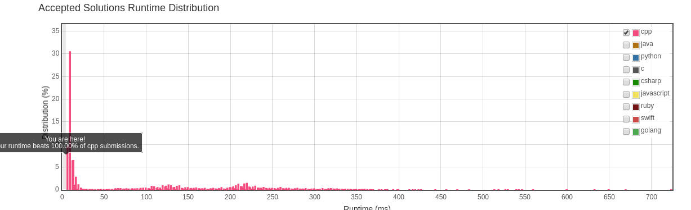



###TwoSum问题
都说知易行难，的确是这样的。最近靠leetcode练练手保持手感，结果一个TwoSum做了我三天，提交了5次才过。虽然都是碎片时间做的，但还是很尴尬。

[TwoSum](https://leetcode.com/problems/two-sum/#/description)本身问题不复杂。读题的时候有几个疑惑点，包括数字是否可以重复和输入是否有序，尝试提交几遍后就理清了。问题提示使用二叉树进行求解，但我总觉得二叉树从零写个不太方便，而且效率充其量是nlogn的效率，所以从一开始就想使用CountSort进行求解。

使用CountSort进行求解后，代码也逐渐复杂化了，用了一个内部类用来记入元素数量和序号;并且提交多次，总是很多问题会没考虑到，的确要多练习。

最终结果：
