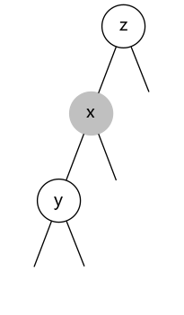
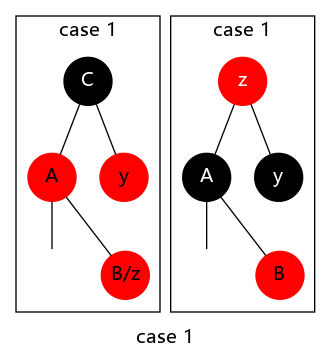
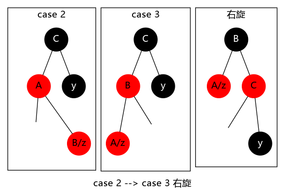
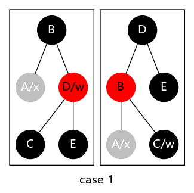
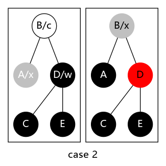
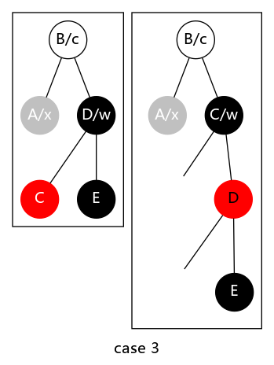
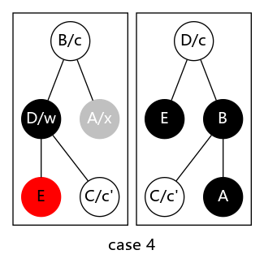

# 红黑树
本篇文章的目的，学习红黑树。使用教材，"Introduction to Algorithms 3rd"。

##综述
首先，红黑树的五种属性：
1. 每个节点必然时红色或者黑色；
2. 根节点是黑色；
3. 每个叶子节点也是黑色；
4. 如果一个节点是红色，那么它的子节点必然是黑色；
5. 对每个节点从根节点到后代叶子节点的路径上有同样多的黑色节点；

**黑高度** : 对每个节点x到其后代叶子节点的路径上黑节点的数量，但不包括x本身，记作bh(x).
我们将根节点的黑高度记作红黑树的黑高度。


**Lemma 1** 
内部节点数为n的红黑树树高最多2lg(n+1).

简单的证明：
+ 对任一节点x来说至少有pow(2,bh(x)) -1个内部节点,这点可以用归纳法证明
+ 由属性4，对于树高为h的红黑树，除了根节点外至少有h/2的节点为黑。


##旋转
旋转分为左旋和右旋。

左旋x节点，z的左子节点接到x的右侧，x接到z的左侧。

   

右旋x节点，y的右子节点接到x的左侧，x接到y的右侧。

 


```
Left-Rotate(T,x)
    y = x.right 
    x.right = y.left
    if y.left != T.nil
        y.left.p = x
    y.p = x.p
    if x.p == T.nil
        T.root = y
    elseif x == x.p.left
        x.p.left = y
    elseif x == x.p.right
        x.p.right = y
    y.left = x
    x.p = y
```
```
Right-Rotate(T,y)
    x = y.left
    y.left = x.right;
    if x.right != T.nil
        x.right.p = y
    x.p = y.p
    if y.p == T.nil
        T.root = x
    elseif y == y.p.left
        y.p.left = x
    elseif y == y.p.right
        y.p.right = x
    x.right = y
    y.p = x
```
## 插入

```
RB-INSERT(T,z)
    y = T.nil
    x = T.root
    while x != T.nil
        y = x
        if z.key < x.key
            x = x.left
        else x= x.right
    z.p = y
    if y == T.nil
        T.root = z
    elseif z.key < y.key
        y.left = z
    else y.right = z
    z.left = T.nil
    z.right = T.nil
    z.color = RED
    RB-INSERT-FIXUP(T,z)
```

对于`RB-INSERT-FIXUP`，考虑插入z后,由于z为红色，只有属性2和4可能不满足。
+ 属性2不满足的情况在于， z插入后为根节点；
+ 属性4不满足的情况在于，z插入后，z的父节点也为红色。

插入操作保持循环不变性：
a. 节点z是红色节点；
b. 如果z.p是根节点，那么z.p必然是黑色；
c. 树的插入至多只会导致一条属性不满足。

循环不变性的证明：
```
Initialization:
    a. 在开始时，z作为红色节点插入；
    b. 如果z.p是根节点，那么根节点必然时黑节点；
    c. 如果属性2不满足，那么z必然是作为根节点插入的,且此时只有可能这一条属性不满足；如果
    属性4 不满足，则此时z.p与z均是红节点，同样只有可能这一条熟悉不满足。

Termination:
    a. 循环只会在节点z的父亲z.p未黑色节点时结束，通过在循环结束时将树根节点设置为黑色，属性2与4就都满足了。

Maintenance:
    如果插入后，属性4不满足，z.p为红色，那么z.p.p必然为黑节点。
   case 1: z的叔叔节点是红色。 z.p与y均为红色节点。此时我们将z.p与y均染成黑色，将
   z.p.p染成红色，那么对于z来说，可保持属性4和属性5。新的可能出现问题的节点上移到z.p.p。
   case 2: z的叔叔节点是黑色，此时z是右孩子。
   case 3: z的叔叔节点是黑色，此时z是左孩子。
   对于情形2，我们对z.p左旋，从而将情形2化为情形3。此时z是左孩子，z与z.p均为红色，z的叔叔节点y时黑色，z.p.p不变。
   我们将z.p染成黑色，z.p.p染成红色，然后右旋z.p.p。此时z.p变成黑色，属性2与4均满足，我们将z.p.p染成红色后，黑高减一，但现在我们将z.p染成黑色，黑高加一，于是属性5满足。
```


具体算法如下：
```
RB-INSERT-FIXUP(T,z)
    while z.p.color == RED
        if z.p == z.p.p.left
            y = z.p.p.right
            if y.color == RED               // case 1
                z.p.color = BLACK
                y.color = BLACK
                z.p.p.color = RED
                z = z.p.p
            else
                if z == z.p.right          // case 2
                    z = z.p
                    Left-Rotate(T,z)
                z.p.color = BLACK          // case 3
                z.p.p.color = RED          // case 3 
                Right-Rotate(T,z.p.p)
        else                               // z.p == z.p.p.right
            y = z.p.p.left
            if y.color == RED              // case 1'
                z.p.color = BLACK
                y.color = BLACK
                z.p.p.color = RED
                z= z.p.p
            else
                if z == z.p.left           // case 2'
                    z = z.p
                    Right-Rotate(T,z)
                z.p.color = BLACK          // case 3'
                z.p.p.color = RED          // case 3'
                Left-Rotate(T,z.p.p)

    T.root.color = BLACK

```
分析

对于有n个内部节点的红黑树，数高最多为O(lgn),那么`RB-INSERT-FIXUP`中`while`循环最多执行logn次，并且每次最多执行两次旋转。
## 删除
```
RB-TRANSPLANT(T,u,v)
    if u.p == T.nil
        T.root = v
    elseif u == u.p.left
        u.p.left = v
    else
        u.p.right ==v
    v.p = u.p
```
```
RB-Delete(T,z)
    y = z
    y-original-color = y.color
    if z.left == T.nil
        x = z.right
        RB-TRANSPLANT(T,z,z.right)
    elseif z.right == T.nil
        x = z.left
        RB-TRANSPLANT(T,z,z.left)
    else
        y = TREE-MINIMUM(z.right) // y 是z的直接后继
        y-original-color = y.color
        x = y.right
        if y.p == z
            x.p = y
        else 
            RB-TRANSPLANT(T,y,y.right)
            y.right = z.right
            y.right.p = y
        RB-TRANSPLANT(T,z,y)
        y.left = z.left
        y.left.p = y
        y.color = z.color
    if y-original-color == BLACK
        RB-DELETE-FIXUP(T,x)
```
删除操作的解析。
+ 变量y用来记录准备删除或移动的节点。当z没有孩子或只有一个孩子时，y设置为z，我们直接删除y；当z有两个孩子时，我们将y设置为z的后置节点，将y移动到
z的位置。
+ 由于节点y的颜色可能发生变化，我们记录y的原本颜色，并在删除操作结束时判断是否需要`RB-DELETE-FIXUP`。
+ 由于y节点的移动，我们需要在y原来的位置填补新的节点，由以上讨论知道，y最多只有一个节点。我们将这个节点记作x，x节点或者是y的唯一子节点，或者是
T.nil，我们将x移动到y原来的位置。这里需要注意的是，如果z的直接后继y的父亲节点就是z的子节点，此时x节点填补y移动后的位置应该将y作为父节点，而不是将y.p
作为父节点，作为y.p的z会被我们删除。
+ 如果y是黑色，我们删除或者移动y都有可能造成红黑树属性不满足，我们必须在最后调用`RB-DELETE-FIXUP`进行修复。
    * 如果y是根节点，删除后y的一个红色子节点变成新的根，属性2不满足；
    * 如果x与x.p均为红色，属性4不满足；
    * 将y移动到z的位置后，原先包括y的路径会少一个黑高，属性5不满足。

先来考虑属性5不满足的情况。由于y作为一个黑色节点被删除或移动，x顶替y的位置，原先包含y的简单路径上的树高减一。我们直接将这个额外的树高赋给x，于是现在变成属性1不满足了,并且不满足的节点只有x，我们对此做处理：
+ 如果x是RED-BLACK节点，我们简单的将x染成黑色，属性1满足。此时bh(x)不变。
+ 如果x是BLACK-BLACK节点，且是根节点，我们将这个额外的黑色移除。于是总体树的黑高减一,属性1满足，属性5满足。
+ 如果x是BLACK-BLACK节点，且不是根节点，我们需要做旋转。
    * 情形1,x的兄弟节点w是红节点。于是x必然有黑色的子节点，x.p必为黑色。我们将x.p的颜色与w的颜色互换，然后左旋x.p，此时，x的兄弟节点就变成黑色了,并且此时保持属性5不变。
    * 情形2，x的兄弟节点w是黑节点。w的子节点均是黑节点。我们将x与w均染红，将多出的黑色给于x的父节点x.p。此时x.p变成新的x继续处理。
    * 情形3，x的兄弟节点w是黑节点。w的左子节点是红，右子节点是黑色。我们将w的左子节点与w的颜色互换，并右旋w，这样就变成情形4。
    * 情形4，x的兄弟节点w是黑节点。w的右子节点是红色。我们将w与w.p的颜色互换。将w的右节点颜色置为黑色，并左旋x.p。这样，我们可以将x的BLACK-BLACK变成BLACK即可。
对于属性4和属性2不满足，我们简单的将x置黑即可。

   

   

 

 
```
RB-DELETE-FIXUP(T,x)
    while x != T.root and x.color == BLACK
        if x == x.p.left
            w = x.p.right
            if w.color == RED       // case 1
                w.color = BLACK
                x.p.color = RED     // case 1
                LEFT-ROTATE(T,x.p)
                w = x.p.right
            if w.left.color == BLACK and w.right.color == BLACK 
                w.color = RED
                x = x.p             // case 2
            else if w.right.color == BLACK      // case 3
                    w.left.color = BLACK
                    w.color = RED
                    RIGHT-ROTATE(T,w)
                    w = x.p.right
                w.color = x.p.color             // case 4
                x.p.color = BLACK
                w.right.color = BLACK
                LEFT-ROTATE(T,x.p)
                x = T.root
        else                        // 此时x是右节点
            w = x.p.left
            if w.color == RED       // case 1'
                w.color = BLACK     // 互换颜色
                x.p.color = RED     // case 1'
                RIGHT-ROTATE(T,x.p)
                w = x.p.left
            if w.left.color == BLACK and w.right.color == BLACK
                w.color = RED
                x = x.p             // case 2'
            else if w.left.color == BLACK       // case 3'
                    w.right.color = BLACK
                    w.color = RED
                    LEFT-ROTATE(T,w)
                    w = x.p.left
               w.color = x.p.color          // case 4'
               x.p.color = BLACK
               w.left.color = BLACK
               RIGHT-ROTATE(T,x.p)
               x = T.root                   // terminate

        x.color = BLACK                     // set root to BLACK
```
分析
只有情形2会造成whilte循环重入，且对于有n个内部节点的树来说，树高最多为O(lgn)，于是删除时间最多为O(lgn)。

## 代码
```
#ifndef __RED_BLACK_TREE_H__
#define __RED_BLACK_TREE_H__ 1
#include <iostream>
#include <queue>

const int RED = 0;
const int BLACK = 1;
const int BLACK_BLACK= 3;
const int BLACK_RED = 4;
template<class T>
class BinNode
{
public:
    BinNode (const T& data)
        :_data(data)
    {
        _color = BLACK;
        _lc = NULL;
        _rc = NULL;
        _p = NULL;
    }
    virtual ~BinNode (){}

    int & color() {return _color;}
    BinNode*& lc(){return _lc;}
    BinNode*& rc(){return _rc;}
    BinNode*& p(){return _p;}

    T& data(){return _data;}

private:
private:
    /* data */
    int _color;
    BinNode* _lc;
    BinNode* _rc;
    BinNode* _p;
    T _data;
};

template<class T>
class BinTree
{
    public:

        static BinNode<T>* nil;
    public:
        BinTree()
        {
            _root = nil;
        }
        void insert(BinNode<T>* node);
        BinNode<T>* search(const T & t) const;

        void deletenode(BinNode<T>* z);
        void dfs();
        void bfs();
        BinNode<T>* root(){return _root;}
        void LeftRotate(BinNode<T>* x) {left_rotate(x);}
        void RightRotate(BinNode<T>* x){right_rotate(x);}

    private:
        BinNode<T>* search_recur(BinNode<T>* node, const T& t) const;
        void insert_fixup(BinNode<T>* node);
        void left_rotate(BinNode<T>* x);
        void right_rotate(BinNode<T>* x);
        void transplant(BinNode<T>* u, BinNode<T>* v);
        BinNode<T>* minimum(BinNode<T>* node);

        void delete_fixup(BinNode<T>* x);

        void dfs_recur(BinNode<T>* node);
        
    private:
        BinNode<T>* _root;
    public:
        static BinNode<T>* make_node(const T& t)
        {
            BinNode<T>* node = new BinNode<T>(t);
            node->color() = RED;

            node->lc() = nil;
            node->rc() = nil;
            node->p() = nil;

            return node;
        }

};


template<class T>
BinNode<T>* BinTree<T>::nil = new BinNode<T>(-1);

template<class T>
BinNode<T>* BinTree<T>::search(const T& t) const
{
    return search_recur(_root, t);
}
template<class T>
BinNode<T>* BinTree<T>::search_recur(BinNode<T>* node, const T& t) const
{
    if(node == nil) return nil;
    if(node->data() == t) return node;
    if(node->data() < t)
    {
        return search_recur(node->rc(),t);
    }
    if (node->data() > t)
    {
        return search_recur(node->lc(),t);
    }
    return nil;

}
template<class T>
void BinTree<T>::dfs()
{
    dfs_recur(_root);
}
static const char* getColor(int color)
{
    if (color == RED)
    {
        return "red";
    }
    else if(color == BLACK)
    {
        return "black";
    }
    else if(color == BLACK_BLACK)
    {
        return "black_black";
    }
    else if(color == BLACK_RED)
    {
        return "black_red";
    }
    return "";
}
template <class T>
void BinTree<T>::bfs()
{
    if (_root == nil) return;
    std::queue<BinNode<T>* > q;
    q.push(_root);
    int cur = 1;
    int next =0;
    while(q.size() > 0)
    {
        BinNode<T>* node = q.front();

        q.pop();
        std::cout<<node->data() << " "<<getColor(node->color())<<"    ";


        if(node->lc() != NULL)
        {
            q.push(node->lc());
            next ++;
        }
        if(node->rc() != NULL)
        {
            q.push(node->rc());
            next += 1;
        }

        cur--;
        if(cur <=0)
        {
            std::cout<<std::endl;
            cur = next;
            next = 0;
        }
    }
    std::cout<<std::endl;
}

    template<class T>
void BinTree<T>::dfs_recur(BinNode<T>* node)
{
    if(node->lc() != nil)
    {
        dfs_recur(node->lc());
    }
    if(node->rc() != nil)
    {
        dfs_recur(node->rc());
    }
    std::cout<<" "<<node->data()<<" ";
}

    template<class T>
BinNode<T>* BinTree<T>::minimum(BinNode<T>* node)
{

    while(node->lc() != nil)
    {
        node = node->lc();
    }
    return node;


}

    template<class T>
void BinTree<T>::transplant(BinNode<T>* u, BinNode<T>* v)
{
    if(u->p() == nil)
    {
        _root = v;
    }
    else if(u == u->p()->lc())
    {
        u->p()->lc() = v;
    }
    else
    {
        u->p()->rc() = v;
    }
    v->p() = u->p();
}
    template<class T>
void BinTree<T>::deletenode(BinNode<T>* z)
{
    BinNode<T>* y = z;
    BinNode<T>* x= nil;
    int y_original_color = y->color();
    if (z->lc() == nil)
    {
        x = z->rc();
        transplant(z,z->rc());
    }
    else if(z->rc() == nil)
    {
        x = z->lc();
        transplant(z,z->lc());
    }
    else
    {
        y = minimum(z->rc());
        y_original_color = y->color();
        x = y->rc();
        if(y->p() == z)
        {
            x->p() = y;
        }
        else
        {
            transplant(y,y->rc());
            y->rc() = z->rc();
            y->rc()->p() = y;
        }
        transplant(z,y);
        y->lc() = z->lc();
        y->lc()->p() = y;
        y->color() = z->color();
    }
    if(y_original_color == BLACK)
    {
        std::cout<<"delete_fixup "<<x->data()<<std::endl;
        delete_fixup(x);
    }

}

    template<class T>
void BinTree<T>::delete_fixup(BinNode<T>* x)
{
    BinNode<T> * w;
    while( x != _root && x->color() == BLACK)
    {
        if(x == x->p()->lc())
        {
            w = x->p()->rc();
            if(w->color() == RED) // case 1
            {
                w->color() = BLACK;
                x->p()->color() = BLACK;
                left_rotate(x->p());
                w = x->p()->rc();
            }
            if(w->lc()->color() == BLACK && w->rc()->color() == BLACK)
            {
                w->color() = RED;
                x = x->p();
            }
            else
            {
                if(w->rc()->color() == BLACK)
                {
                    w->lc()->color() = BLACK;
                    w->color() = RED;
                    right_rotate(w);
                    w = x->p()->rc();
                }
                w->color() = x->p()->color();
                x->p()->color()  = BLACK;
                w->rc()->color() = BLACK;
                left_rotate(x->p());
                x = _root;
            }
        }
        else
        {
            w = x->p()->lc();
            if(w->color() == RED)
            {
                w->color() = BLACK;
                x->p()->color() = RED;
                right_rotate(x->p());
                w = x->p()->lc();
            }
            if(w->lc()->color() == BLACK && w->rc()->color() == BLACK)
            {
                w->color() = RED;
                x = x->p();
            }
            else
            {
                if(w->lc()->color() == BLACK)
                {
                    w->rc()->color() = BLACK;
                    w->color() = RED;
                    left_rotate(w);
                    w = x->p()->lc();
                }
                w->color() = x->p()->color();
                x->p()->color() = BLACK;
                w->lc()->color() = BLACK;
                right_rotate(x->p());
                x = _root;
            }
        }
    }
    x->color() =BLACK;
}
    template<class T>
void BinTree<T>::left_rotate(BinNode<T>* x)
{
    BinNode<T>* y = x->rc();
    x->rc() = y->lc();
    if(y->lc() != nil)
    {
        y->lc()->p() = x;
    }
    y->p() = x->p();
    if(x->p() == nil)
    {
        _root = y;
    }
    else if (x == x->p()->lc())
    {
        x->p()->lc() = y;
    }
    else if(x == x->p()->rc())
    {
        x->p()->rc() = y;
    }
    y->lc() = x;
    x->p() = y;
}
template<class T>
void BinTree<T>::right_rotate(BinNode<T>* y)
{

    BinNode<T>* x = y->lc();
    y->lc()  = x->rc();
    if(x->rc() != nil)
    {
        x->rc()->p() = y;
    }
    x->p() = y->p();
    if(y->p() == nil)
    {
        _root = x;
    }
    else if(y == y->p()->lc())
    {
        y->p()->lc() = x;
    }
    else if(y == y->p()->rc())
    {
        y->p()->rc() =x;
    }
    x ->rc() = y;
    y->p() = x;
}
    template<class T>
void BinTree<T>::insert_fixup(BinNode<T>* z)
{
    BinNode<T>* y;
    while(z->p()->color() == RED)
    {
        if(z->p() == z->p()->p()->lc())
        {
            y = z->p()->p()->rc();
            if (y->color() == RED)
            {
                z->p()->color() = BLACK;
                y->color() = BLACK;
                z->p()->p()->color() = RED;
                z = z->p()->p();
            }
            else
            {
                if(z == z->p()->rc())
                {
                    z = z->p();
                    left_rotate(z);
                }
                z->p()->color() = BLACK;
                z->p()->p()->color() = RED;
                right_rotate(z->p()->p());
            }
        }
        else
        {
            //std::cout<<"case 2'"<<std::endl;
            y = z->p()->p()->lc();
            if (y ->color() == RED)
            {
                z->p()->color() = BLACK;
                y->color() = BLACK;
                z->p()->p()->color() = RED;
                z = z->p()->p();
            }
            else
            {
                if (z == z->p()->lc())
                {
                    z = z->p();
                    right_rotate(z);
                    //std::cout<<"right_rotate for case 2"<<std::endl;
                    //bfs();
                }
                z->p()->color() = BLACK;
                z->p()->p()->color() = RED;
                left_rotate(z->p()->p());
            }
        }
    }
    _root->color() = BLACK;
}

    template<class T>
void BinTree<T>::insert(BinNode<T>* node)
{
    BinNode<T>* y = nil;
    BinNode<T>* x= _root;;
    while (x != nil)
    {
        y = x;
        if(node->data() < x->data())
        {
            x = x->lc();
        }
        else
        {
            x = x->rc();
        }
    }
    node->p() = y;
    if (y == nil )
    {
        _root = node;
    }
    else if(node->data() < y->data())
    {
        y->lc() = node;
    }
    else
    {
        y->rc() = node;
    }
    node->lc() = nil;
    node->rc() = nil;
    node->color() = RED;
    //std::cout<<"before insert_fixup "<<std::endl;
    //bfs();
    //std::cout<<"==================="<<std::endl;
    insert_fixup(node);
}


#endif /* ifndef __RED_BLACK_TREE_H__*/
```
